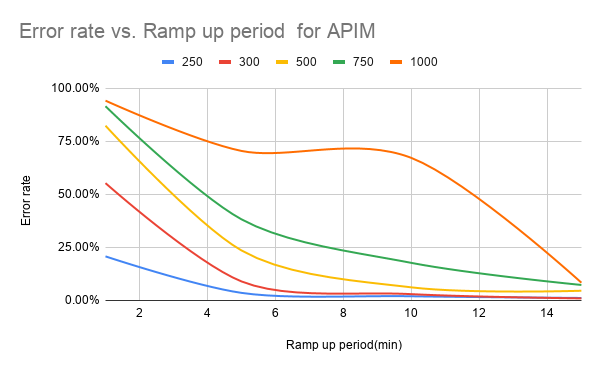
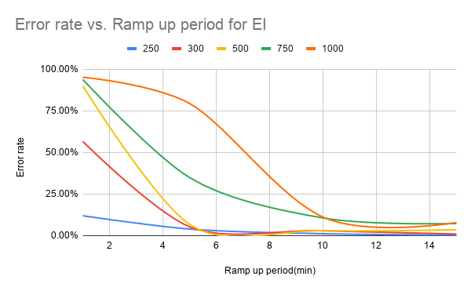
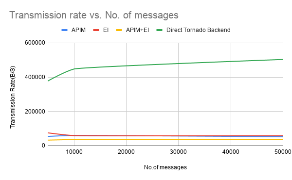
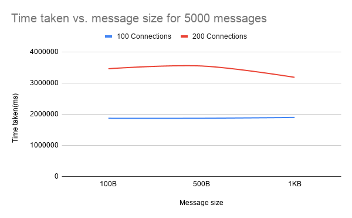
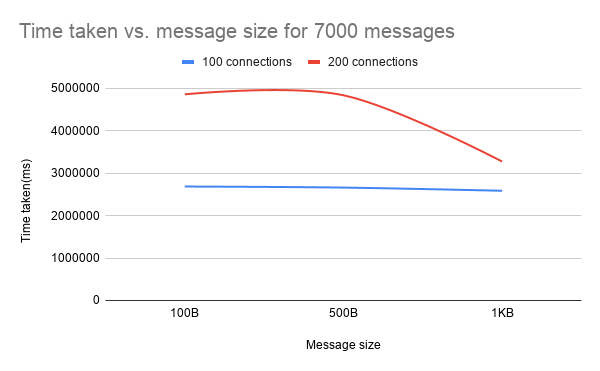
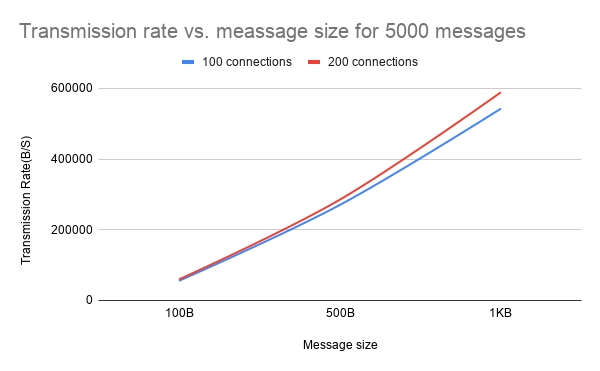
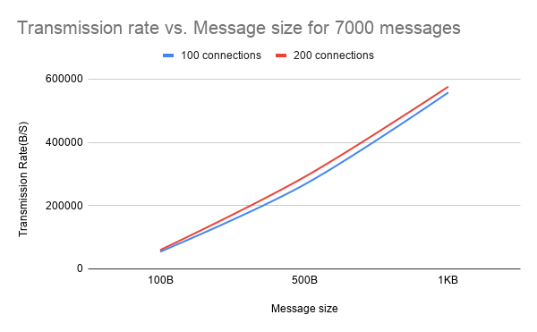

# Artifacts for WSO2 API Manager WebSocket API Performance Tests

---
|  Branch | Build Status |
| :------ |:------------ |
| master  |  |
---

This repository has artifacts to be used for WSO2 API Manager WebSocket API Performance Tests.

The [distribution](distribution) directory has the jmeter scripts used to evaluate the performance of WebSocket APIs.

## Approach

* First, the number of connections that a single WebSocket API can handle was evaluated using Jmeter while increasing the ramp up period. And the Enterprise Integrator also evaluated for the number of connections that a WebSocket endpoint can handle when connecting through WSO2 EI.
* Then, perfomance with message rates was evaluated while establishing a single connection. For this, Thor was used as the WebSocket client and Tornardo was used as the backend.
  
  **Note:** When sending messages using Thor WebSocket client, Thor send a message and wait for the response from backend to send the next message.
* Finally, another evaluation was done to measure the perfomance of APIM with different number of connections and message rates.

## Evaluation results

Following graph shows how the error rate varies with the ramp up period for 250,300,500,750 and 1000 connections for APIM.

**Note:** A single JWT Token is used per test execution for APIM.

Following graph shows how the error rate varies with the ramp up period for 250,300,500,750 and 1000 connections for EI.

Following graph compares how total time taken for sending requests varies with the number of messages for APIM, EI, APIM+EI and direct tornado backend.

Following graph compares how transmission rate varies with the number of messages for APIM, EI, APIM+EI and direct tornado backend.

Following set of graphs show how the performance of APIM varies with the number of connections and number of messages.

* Time taken vs. message size for different number of messages.

.png)

* Transmission rate vs. message size for different number of messages.

.png)

## License

Copyright 2017 WSO2 Inc. (http://wso2.com)

Licensed under the Apache License, Version 2.0
