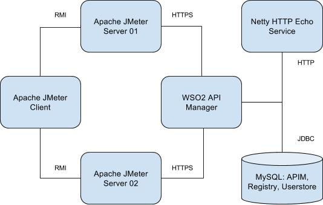

# Artifacts for WSO2 API Manager and WSO2 API Microgateway Performance Tests

---
|  Branch | Build Status |
| :------ |:------------ |
| master  | [](https://wso2.org/jenkins/job/platform-builds/job/performance-apim/) |
---

This repository has artifacts to be used for WSO2 API Manager Performance Tests.

The [distribution](distribution) directory has the scripts and the Maven project to build the final distribution package
 to be used for performance tests.

The package (**performance-apim-distribution-${version}.tar.gz**) built by the distribution maven module is the
 package required for API Manager performance tests from this repository.

The scripts in this repository depend on the scripts in
 "[performance-common](https://github.com/wso2/performance-common/)" repository.

**Note:** The scripts are only compatible with **WSO2 API Manager 2.6.0**.

Following is the recommended deployment for performance testing All-in-one WSO2 API Manager.



## Package contents

Following is the tree view of the contents inside distribution package.

```console
ubuntu@server:~$ tree --charset=ascii | sed -e 's/[0-9]\.[0-9]\.[0-9].*\.jar/${version}.jar/g'
.
|-- apim
|   |-- apim-start.sh
|   |-- conf
|   |   |-- datasources
|   |   |   `-- master-datasources.xml
|   |   |-- registry.xml
|   |   `-- user-mgt.xml
|   |-- configure.sh
|   |-- create-api.sh
|   |-- generate-tokens.sh
|   |-- micro-gw
|   |   |-- create-micro-gw.sh
|   |   |-- generate-jwt-tokens.sh
|   |   |-- jwt-generator-${version}.jar
|   |   |-- micro-gw-start.sh
|   |   `-- wso2carbon.jks
|   `-- sqls
|       `-- create-databases.sql
|-- cloudformation
|   |-- cloudformation-common.sh
|   |-- create-template.py
|   |-- download-logs.sh
|   |-- get-wum-updated-wso2-product.sh
|   |-- python-requirements.txt
|   |-- run-micro-gw-performance-tests.sh
|   |-- run-performance-tests.sh
|   `-- templates
|       |-- apim_micro_gw_perf_test_cfn.yaml
|       |-- apim_perf_test_cfn.yaml
|       `-- common_perf_test_cfn.yaml
|-- common
|   `-- common.sh
|-- java
|   `-- install-java.sh
|-- jmeter
|   |-- apimchart.py
|   |-- apim-test.jmx
|   |-- create-charts.py
|   |-- create-comparison-charts.py
|   |-- create-summary-csv.sh
|   |-- create-summary-markdown.py
|   |-- csv-to-markdown-converter.py
|   |-- install-jmeter.sh
|   |-- jmeter-server-start.sh
|   |-- perf-test-common.sh
|   |-- run-micro-gw-performance-tests.sh
|   |-- run-performance-tests.sh
|   |-- templates
|   |   `-- summary.md
|   `-- user.properties
|-- jtl-splitter
|   |-- jtl-splitter-${version}.jar
|   `-- jtl-splitter.sh
|-- netty-service
|   |-- netty-http-echo-service-${version}.jar
|   `-- netty-start.sh
|-- payloads
|   |-- generate-payloads.sh
|   `-- payload-generator-${version}.jar
|-- sar
|   `-- install-sar.sh
`-- setup
    |-- setup-apim-micro-gw.sh
    |-- setup-apim.sh
    |-- setup-common.sh
    |-- setup-jmeter-client.sh
    |-- setup-jmeter.sh
    `-- setup-netty.sh

16 directories, 52 files
```

Each directory has executable scripts.

This package must be extracted in user home directory of all JMeter nodes and the API Manager node used for the
 performance tests.

**Note:** These scripts will work only on Debian based systems like Ubuntu.

See following sections for more details.

## Running performance tests on AWS

The performance tests can be run on AWS

### Testing WSO2 API Manager Gateway

Use `cloudformation/run-performance-tests.sh` to run performance tests on WSO2 API Manager Gateway.

```console
ubuntu@server:~$ ./cloudformation/run-performance-tests.sh -h

Usage: 
./cloudformation/run-performance-tests.sh -f <performance_scripts_distribution> [-d <results_dir>] -k <key_file> -n <key_name>
   -j <jmeter_distribution> -o <oracle_jdk_distribution> -g <gcviewer_jar_path>
   -s <stack_name_prefix> -b <s3_bucket_name> -r <s3_bucket_region>
   -J <jmeter_client_ec2_instance_type> -S <jmeter_server_ec2_instance_type>
   -N <netty_ec2_instance_type> 
   -a <wso2am_distribution> -c <mysql_connector_jar> -A <wso2am_ec2_instance_type> -D <wso2am_rds_db_instance_class>
   [-t <number_of_stacks>] [-p <parallel_parameter_option>] [-w <minimum_stack_creation_wait_time>]
   [-h] -- [run_performance_tests_options]

-f: Distribution containing the scripts to run performance tests.
-d: The results directory. Default value is a directory with current time. For example, results-20190124105848.
-k: Amazon EC2 Key File. Amazon EC2 Key Name must match with this file name.
-n: Amazon EC2 Key Name.
-j: Apache JMeter (tgz) distribution.
-o: Oracle JDK distribution.
-g: Path of GCViewer Jar file, which will be used to analyze GC logs.
-s: The Amazon CloudFormation Stack Name Prefix.
-b: Amazon S3 Bucket Name.
-r: Amazon S3 Bucket Region.
-J: Amazon EC2 Instance Type for JMeter Client.
-S: Amazon EC2 Instance Type for JMeter Server.
-N: Amazon EC2 Instance Type for Netty (Backend) Service.
-a: WSO2 API Manager Distribution.
-c: MySQL Connector JAR file.
-A: Amazon EC2 Instance Type for WSO2 API Manager.
-D: Amazon EC2 DB Instance Class for WSO2 API Manager RDS Instance.
-t: Number of stacks to create. Default: 1.
-p: Parameter option of the test script, which will be used to run tests in parallel.
    Default: u. Allowed option characters: ubsm.
-w: The minimum time to wait in minutes before polling for cloudformation stack's CREATE_COMPLETE status.
    Default: 5.
-h: Display this help and exit.
```

### Testing WSO2 API Microgateway

Use `cloudformation/run-micro-gw-performance-tests.sh` to run performance tests on WSO2 API Microgateway.

```console
ubuntu@server:~$ ./cloudformation/run-micro-gw-performance-tests.sh -h

Usage: 
./cloudformation/run-micro-gw-performance-tests.sh -f <performance_scripts_distribution> [-d <results_dir>] -k <key_file> -n <key_name>
   -j <jmeter_distribution> -o <oracle_jdk_distribution> -g <gcviewer_jar_path>
   -s <stack_name_prefix> -b <s3_bucket_name> -r <s3_bucket_region>
   -J <jmeter_client_ec2_instance_type> -S <jmeter_server_ec2_instance_type>
   -N <netty_ec2_instance_type> 
   -a <wso2am_distribution> -c <wso2am_micro_gw_distribution> -A <wso2am_ec2_instance_type>
   [-t <number_of_stacks>] [-p <parallel_parameter_option>] [-w <minimum_stack_creation_wait_time>]
   [-h] -- [run_performance_tests_options]

-f: Distribution containing the scripts to run performance tests.
-d: The results directory. Default value is a directory with current time. For example, results-20190124105955.
-k: Amazon EC2 Key File. Amazon EC2 Key Name must match with this file name.
-n: Amazon EC2 Key Name.
-j: Apache JMeter (tgz) distribution.
-o: Oracle JDK distribution.
-g: Path of GCViewer Jar file, which will be used to analyze GC logs.
-s: The Amazon CloudFormation Stack Name Prefix.
-b: Amazon S3 Bucket Name.
-r: Amazon S3 Bucket Region.
-J: Amazon EC2 Instance Type for JMeter Client.
-S: Amazon EC2 Instance Type for JMeter Server.
-N: Amazon EC2 Instance Type for Netty (Backend) Service.
-a: WSO2 API Manager Distribution.
-c: WSO2 API Microgateway Distribution.
-A: Amazon EC2 Instance Type for WSO2 API Manager.
-t: Number of stacks to create. Default: 1.
-p: Parameter option of the test script, which will be used to run tests in parallel.
    Default: u. Allowed option characters: ubsm.
-w: The minimum time to wait in minutes before polling for cloudformation stack's CREATE_COMPLETE status.
    Default: 5.
-h: Display this help and exit.
```

## Running performance tests on other enviroments

The scripts can also be used to run performance tests on environments other than AWS.

Following are the high-level steps to run the performance tests.

* Copy the `performance-apim` distribution to all servers.
* Extract the packages in user home directory
* Use scripts in `setup` directory to setup each server.
Note: `setup-common.sh` is a common script, which should not be executed directly.
* Run the WSO2 API Manager Gateway performance tests using `jmeter/run-performance-test.sh` script in JMeter Client.
* Run the WSO2 API Microgateway performance tests using `jmeter/run-micro-gw-performance-tests.sh` script in JMeter Client.
* Use `jmeter/create-summary-csv.sh` to generate a summary.csv file from the test results.
* Use `jmeter/create-summary-markdown.py` to generate a summary report in markdown format.

## License

Copyright 2017 WSO2 Inc. (http://wso2.com)

Licensed under the Apache License, Version 2.0
