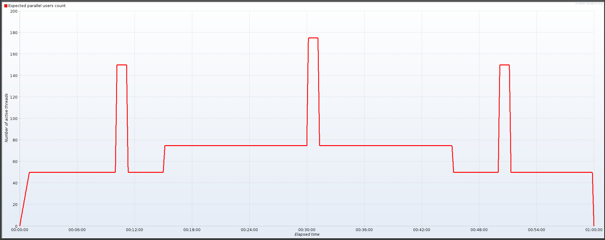

# Artifacts for WSO2 API Manager Long Running Tests

This directory has artifacts to be used for WSO2 API Manager Long Running Tests.

The [setup](setup) directory has the artifacts to setup the API Manager to run the long running tests.

1. TestData_Add_Super_Tenant_Users.jmx - Jmeter script to create users in the super tenant domain
2. create-apps.sh - script to create applications and generate keys in the Developer Portal
3. create-api.sh - script to create, deploy and publish APIs in the Publisher Portal and subscribe the created APIs to applications
4. generate-jwt-tokens.sh - script to generate JWT tokens using application consumer keys to be used for API invocations.
5. token-generation-artifacts - directory which contains the jar used to generate JWT tokens and the keystore file.
6. sequences - directory which contains the mediation sequence which is added to the API for the Mediation API Invocation test.

The [tests](tests) directory has the jmeter test scripts of the long running tests.

1. OAuth_Password_Grant.jmx
2. OAuth_Password_Grant_With_API_Invocation.jmx
3. OAuth_ClientCredentials_Grant.jmx
4. OAuth_ClientCredentials_Grant_With_API_Invocation.jmx
5. API_Invocation.jmx
6. Mediation_API_Invocation.jmx

The above mentioned tests have the following configurations.

- Number of Threads (users): 150
- Ramp-Up Period (seconds): 60
- Duration (second): 3600

7. OAuth_Password_Grant_With_Spikes.jmx
8. OAuth_ClientCredentials_Grant_With_Spikes.jmx

The above 2 tests have the following configurations.

- Duration (second): 3600




The [netty-service](netty-service) directory has the netty service artifacts which can be used as the backend.

## Executing Long Running Tests

### Setting Up

1. Run the `TestData_Add_Super_Tenant_Users.jmx` script to create users in the super tenant domain. The script has been configured to create 50 users.

```
Example Usage:
./jmeter.sh -n -t TestData_Add_Super_Tenant_Users.jmx -l user-creation.jtl
```

This script has been configured to run with the following default values.

- host=localhost
- port=9443

It is possible to override these by passing the values as command line arguments.

```
Example Usage:
./jmeter.sh -n -t TestData_Add_Super_Tenant_Users.jmx -l user-creation.jtl -Jhost=api.am.wso2.com -Jport=9443
```

2. Run the `setup.sh` to setup the environment to run the long running tests. The following will occur when the `setup.sh` is executed.

    - Create applications and generate keys in the Developer Portal. The consumer key, consumer secret of each application will be written to `target/client_credentials.csv` file. The application names will have "app" as the prefix followed by a number such as app1, app2, app3. The script has been configured to create 5 applications.

    - Create, deploy and publish APIs in the Publisher Portal and subscribe the created APIs to applications. The script has been configured to create 5 APIs and each API will be subscribed to all the 5 applications created before.

    - Create, deploy and publish an API in the Publisher Portal and attach a mediation policy to the API. The script has been configured to create 1 API and this API will be subscribed to all the 5 applications created before.

    - Generate JWT tokens using application consumer keys to be used for API invocations. The generated JWT tokens will be written to `target/jwt_tokens.csv` file. The script has been configured to generate 1000 tokens for each application. Since there are 5 applications, 5000 JWT tokens will be generated.

```
Usage:
./setup.sh -a <apim_host> -b <backend_endpoint_url> -v <vhost> [-h]

-a: Hostname of WSO2 API Manager.
-b: Backend endpoint URL.
-v: Virtual Host (VHost).
-h: Display this help and exit.

Example Usage:
    ./setup.sh -a localhost:9443 -b http://localhost:8688/ -v localhost
```

3. Start the netty backend service

```
./netty-start.sh
```

The netty service can be configured to respond after a delay. The delay is specified in milli-seconds.

```
./netty-start.sh -- --delay 5000
```

### Running the Test Scripts

```
Usage:
./jmeter.sh -n -t <test_script> -l <jtl_output>

Example Usage:
./jmeter.sh -n -t API_Invocation.jmx -l invocation-results.jtl
```

The tests have been configured to run with the following default values.

- host=localhost
- port=9443
- gwhost=localhost
- gwport=8243
- concurrency=150
- rampUpPeriod=60

It is possible to override these by passing the values as command line arguments.

```
Example Usage:
./jmeter.sh -n -t OAuth_Password_Grant.jmx -l password-grant-results.jtl -Jhost=api.am.wso2.com -Jport=9443

./jmeter.sh -n -t OAuth_Password_Grant_With_API_Invocation.jmx -l password-grant-results.jtl -Jhost=api.am.wso2.com -Jport=9443 -Jgwhost=gw.am.wso2.com -Jgwport=8243

./jmeter.sh -n -t API_Invocation.jmx -l invocation-results.jtl -Jgwhost=gw.am.wso2.com -Jgwport=8243
```

Note: If the deployment is fronted with a load balancer and does not have a port, use 443 as the port value.

Each test has different configurable properties as indicated below.

1. OAuth_Password_Grant.jmx
    - host
    - port
    - concurrency
    - time
    - rampUpPeriod

2. OAuth_ClientCredentials_Grant.jmx
    - host
    - port
    - concurrency
    - time
    - rampUpPeriod

3. OAuth_Password_Grant_With_API_Invocation.jmx
    - host
    - port
    - concurrency
    - time
    - rampUpPeriod
    - gwhost
    - gwport

4. OAuth_ClientCredentials_Grant_With_API_Invocation.jmx
    - host
    - port
    - concurrency
    - time
    - rampUpPeriod
    - gwhost
    - gwport

5. API_Invocation.jmx
    - concurrency
    - time
    - rampUpPeriod
    - gwhost
    - gwport

6. Mediation_API_Invocation.jmx
    - concurrency
    - time
    - rampUpPeriod
    - gwhost
    - gwport

7. OAuth_Password_Grant_With_Spikes.jmx
    - gwhost
    - gwport

8. OAuth_ClientCredentials_Grant_With_Spikes.jmx
    - gwhost
    - gwport
